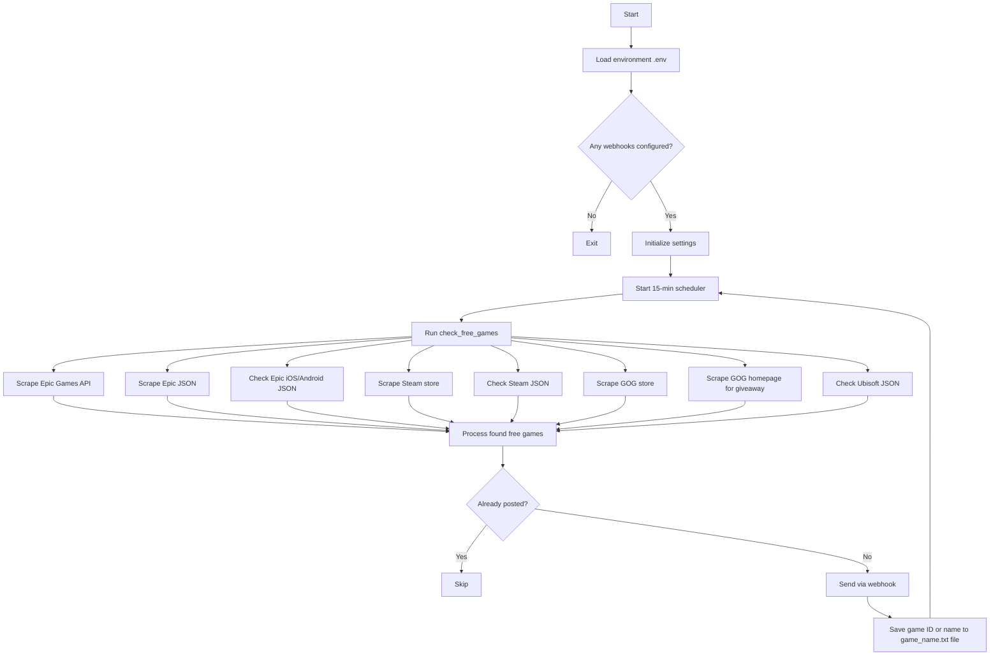

# discord-free-game-notifier

<p align="center">
  
</p>

Discord webhook notifications for free games on Steam, Epic, GOG, and Ubisoft.

## Architecture Overview

- Bot runs a scheduler at xx:01, xx:16, xx:31, xx:46 every hour to check for new free games.
- Steps starting with Scrape steps hit live store APIs/HTML to discover giveaways (e.g., Epic API, Steam store, GOG homepage).
- Check steps read small curated JSON files under `pages/` (published on GitHub Pages) as a source for deals that scrapers can't find.
- `steam_json.py` and `epic_json.py` creates/updates these files with data from the Python files; the `*_json_check.py` modules consume them during the scheduler run.
- Both sources feed the same pipeline; deduping happens via the "Already posted?" check using the saved game IDs/names.

### Main bot workflow



## Setup

**Docker:** See [docker-compose.yml](./docker-compose.yml)

**Direct:**

```bash
# Install uv
# Windows:
powershell -ExecutionPolicy ByPass -c "irm https://astral.sh/uv/install.ps1 | iex"
# macOS/Linux:
curl -LsSf https://astral.sh/uv/install.sh | sh

# Configure: Copy .env.example to .env and set WEBHOOK_URL

# Run (checks at :01, :16, :31, :46 each hour)
uv run python -m discord_free_game_notifier.main
```

## Manual Checking

```bash
# Check stores directly
uv run python -m discord_free_game_notifier.{steam,epic,gog,ubisoft}

# Check JSON files from /pages
uv run python -m discord_free_game_notifier.{steam,epic}_json_check
```

## Generate JSON

For games not found by scraping, modify `create_json_file()` in:

- [steam_json.py](src/discord_free_game_notifier/steam_json.py)
- [epic_json.py](src/discord_free_game_notifier/epic_json.py)

Then run:

```bash
uv run python -m discord_free_game_notifier.{steam,epic}_json
```

## Data Storage

- Windows: `%APPDATA%/TheLovinator/discord_free_game_notifier`
- Linux: `~/.local/share/discord_free_game_notifier/`

## Notes

- VS Code tasks available: `Ctrl+Shift+P` → "Tasks: Run Task"
- JSON files hosted via GitHub Pages: <https://thelovinator1.github.io/discord-free-game-notifier/>
