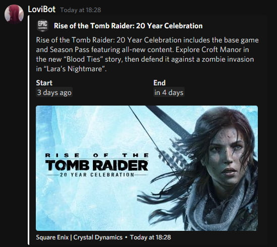

# discord-free-game-notifier

  

Theme is https://github.com/KillYoy/DiscordNight

Send webhook to Discord when a game goes from paid from free on Steam, Epic, GOG and Ubisoft.

## Docker

There is a docker-compose.yml file in the root of the repository.
Please fill in the values in the .env file and run `docker-compose up -d`.

## Usage (GNU/Linux)

- Install [Python](https://www.python.org/) and [Poetry](https://python-poetry.org/docs/master/).
- Download or clone the repository.
- Change directory to the root of the repository.
- Install the dependencies using `poetry install`.
- Rename .env.example to .env and fill in the values. You can also set the values as environment variables.
- Start the bot.
  - `poetry run bot`
- The bot will now check for free games every 15 minutes and send a message to the webhook.
